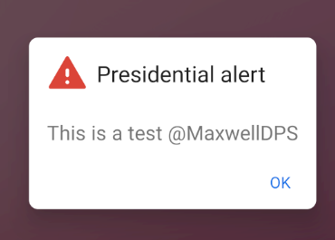

# PaniK

## POC App for Spoofing of WEA Messages at the API UI level


For use case see Alertify [Alertify](https://github.com/MaxwellDPS/Alertify) which uses a gotify server for realtime headless alerts

### API Support
API 23 Android 6 - API 29 Android 10 is supported

#### Alerts Types

| Type | Message Type                  | Type | Message Type                     |
|------|-------------------------------|------|----------------------------------|
| CMAS | Presidental alert             | ETWS | ETWS Tsunami alert               |
| CMAS | Extreme alert                 | ETWS | ETWS Earthquake alert            |
| CMAS | Severe alert                  | ETWS | ETWS Earthquake & Tsunami  alert |
| CMAS | Amber / Child Abduction alert | ETWS | ETWS Other Message               |
| CMAS | Public Safety alert           | ETWS | ETWS Test Message                |
| CMAS | Required Monthly Test         |      |             |                                  |
| CMAS | Local/State Test              |      |             |                                  |
| CMAS | Broadcast Operator alert      |      |             |                                  |
| CMAS | Critical alert                |      |             |                                  |


### Examples

See Example Messages [Images](./Images.md)



## Features

* Spoof WEA via [CMAS](https://en.wikipedia.org/wiki/Wireless_Emergency_Alerts) & [ETWS](https://www.technologyreview.com/2011/03/11/260021/how-japans-earthquake-and-tsunami-warning-systems-work/)


## Installation

Download the apk or build via Android studio.

### Allow display over other apps

By default Android does not allow apps to dispay over other apps

Here is one way to disable battery optimization for Gotify.

* Open "Settings"
* Search for "Apps"
* Find "PaniK" and select Advanced
* Allow Display over other apps

## Building

Execute the following command to build the apk.
```bash
$ ./gradlew build
```

## Update client

* Run `./gradlew generateSwaggerCode`
* Discard changes to `client/build.gradle` (newer versions of dependencies)
* Fix compile error in `client/src/main/java/com/github/gotify/client/auth/OAuthOkHttpClient.java` (caused by an updated dependency)
* Delete `client/settings.gradle` (client is a gradle sub project and must not have a settings.gradle)
* Commit changes


